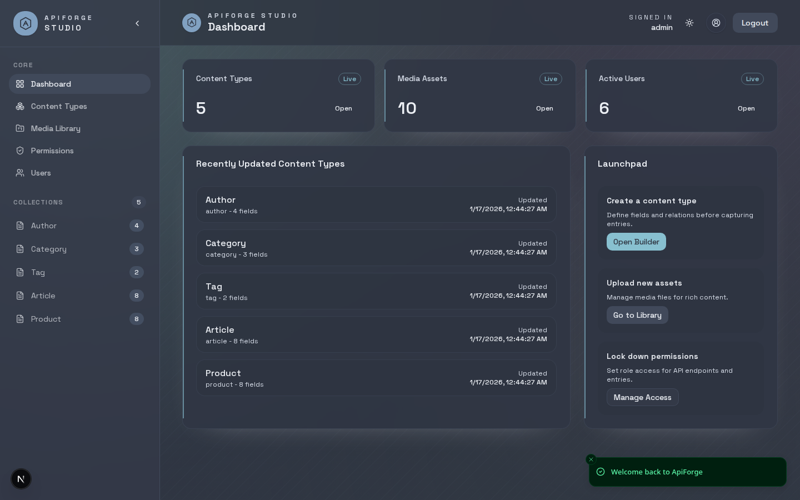
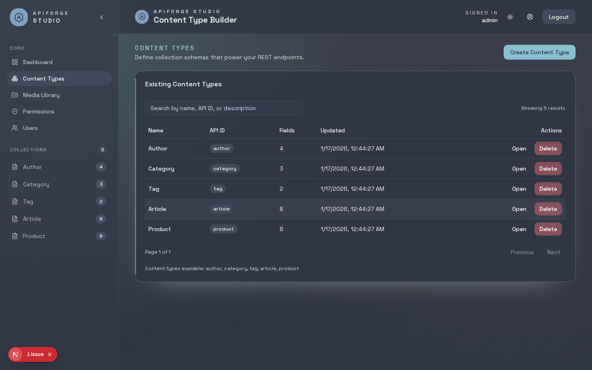
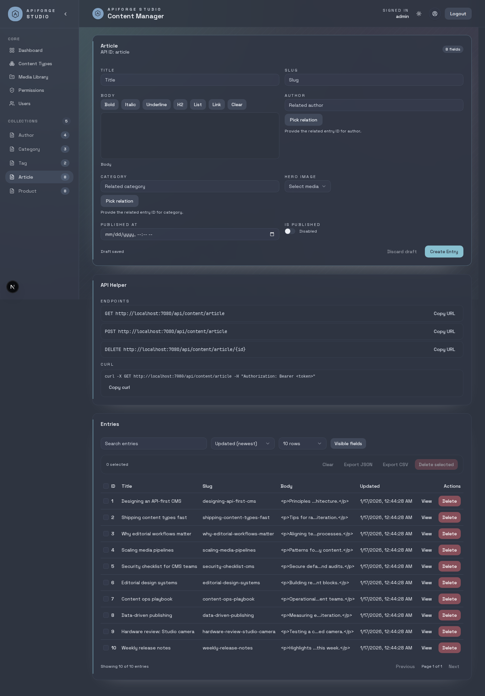
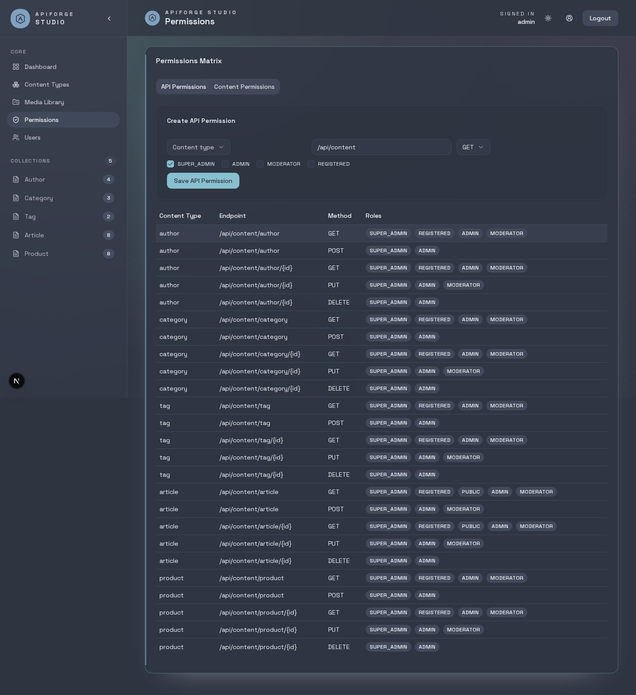

# ApiForge Studio UI

Admin UI for the `apiforge-headless-cms-spring` backend. The interface mirrors Strapi-style workflows for building content types, managing entries, media, permissions, and users.

## UI Screenshots

| Dashboard | Content Types |
| --- | --- |
|  |  |

| Content Entry | Permissions Matrix |
| --- | --- |
|  |  |

## Getting Started

```bash
npm install
npm run dev
```

Open `http://localhost:3000` in your browser.

## Environment Variables

Create a `.env.local` if you need to override defaults:

```
NEXT_PUBLIC_API_BASE_URL=http://localhost:7080
NEXT_PUBLIC_MEDIA_BASE_URL=http://localhost:7084
```

- `NEXT_PUBLIC_API_BASE_URL` points at the API gateway.
- `NEXT_PUBLIC_MEDIA_BASE_URL` points at the media service (uploads currently bypass the gateway).

## Core Routes

- `/login` - Auth login
- `/` - Landing page
- `/dashboard` - Dashboard
- `/content-types` - Content type builder
- `/content/[apiId]` - Content entries
- `/media` - Media library
- `/permissions` - Permissions matrix
- `/users` - User management

## Notes

- The UI expects JWT auth from the `/api/auth/login` endpoint.
- Media downloads are served from `/api/upload/files/:fileName` on the media service.
